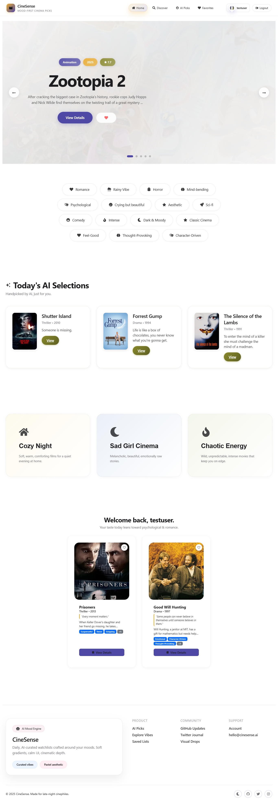
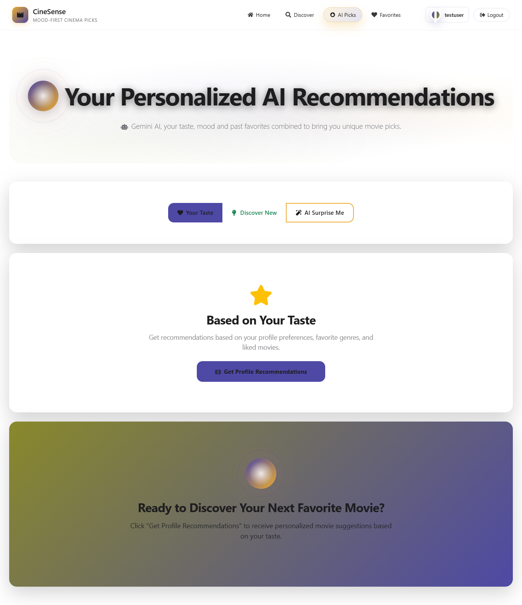
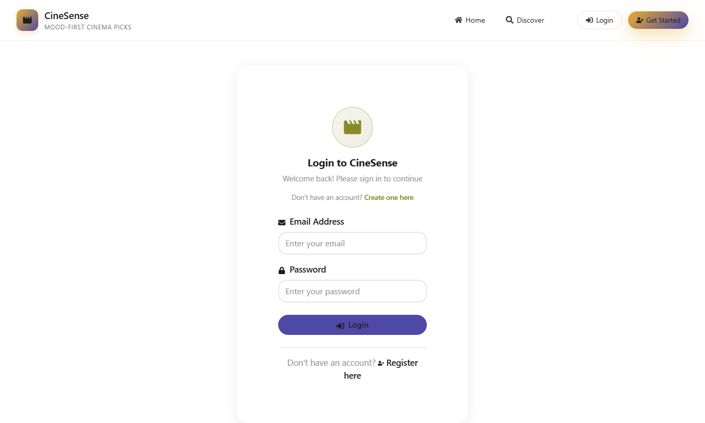
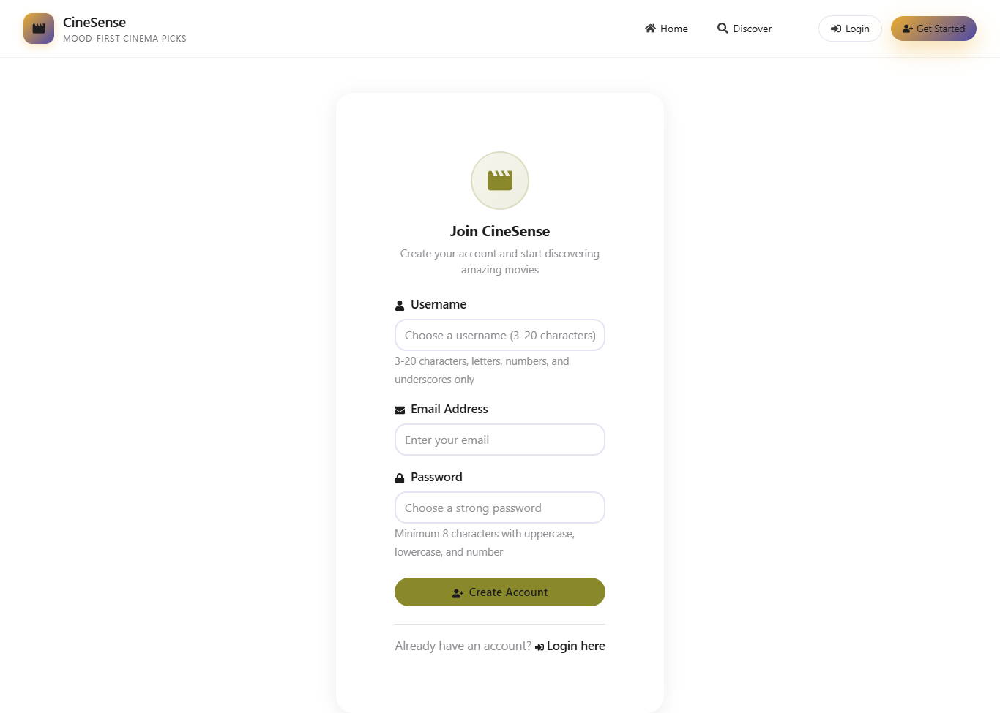
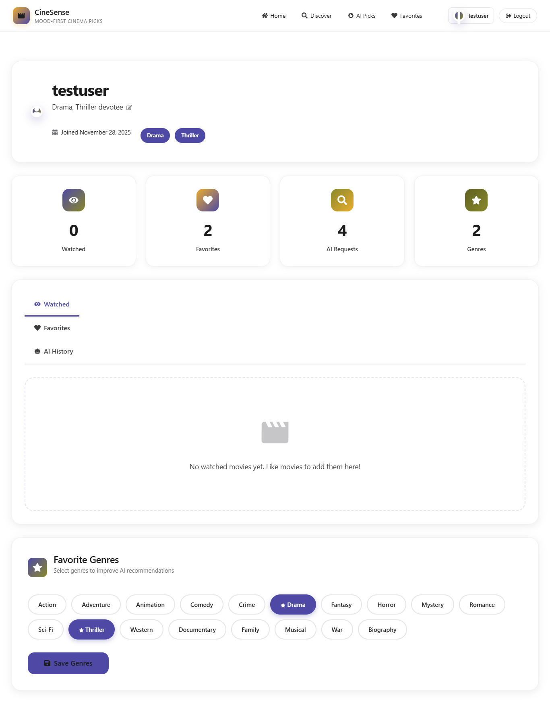
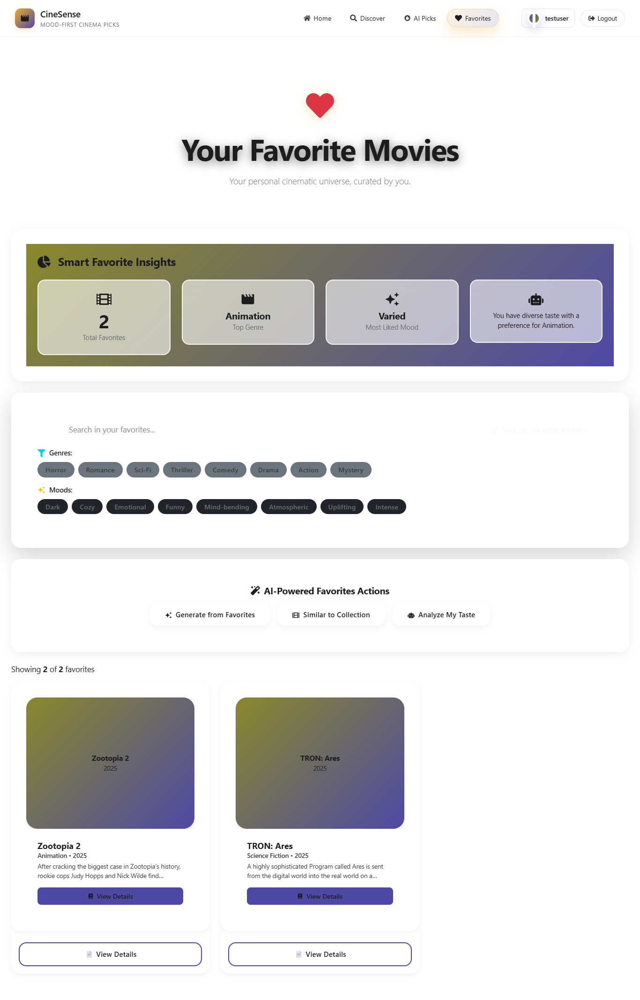
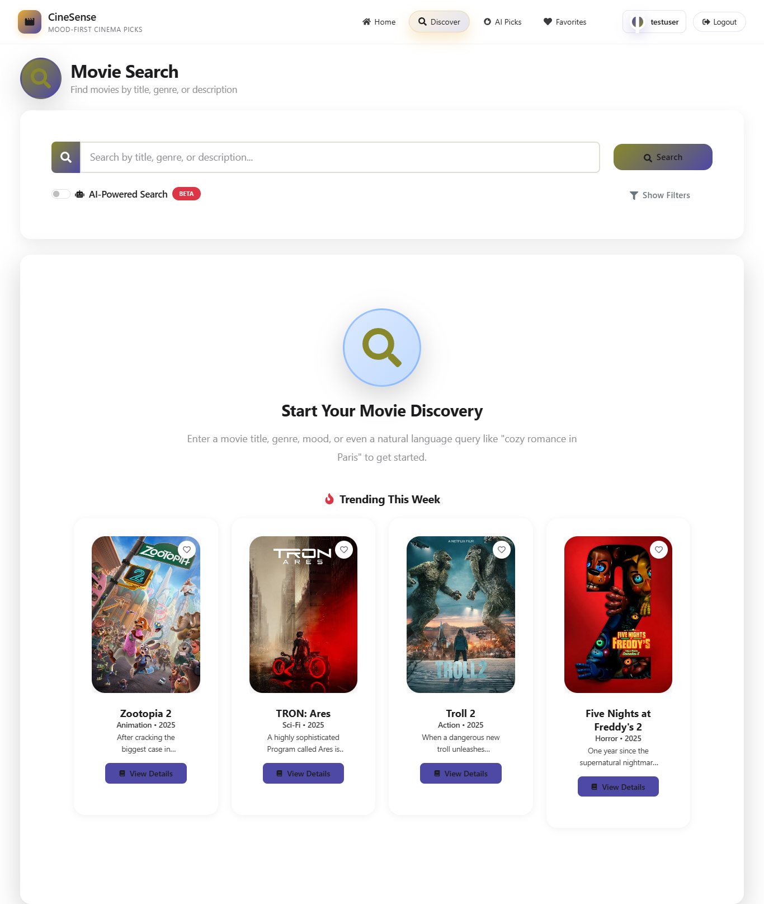
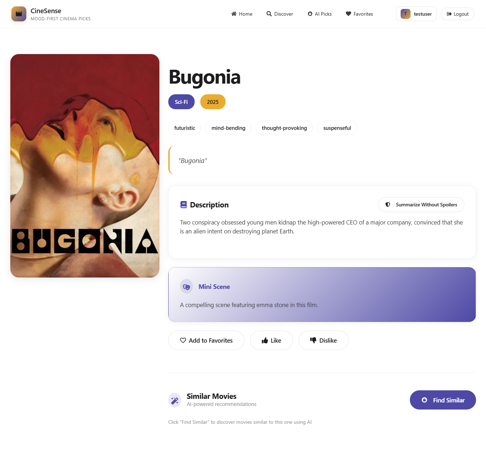

# 🎬 CineSense - AI-Powered Movie Recommendation System

A modern full-stack web application that provides personalized movie recommendations using Google Gemini AI. Built with React, Node.js, and MySQL.


## 📸 Screenshots

### Homepage


*Modern ve temiz tasarıma sahip ana sayfa - AI destekli film önerileri, mood kategorileri ve kişiselleştirilmiş içerikler*

Ana sayfa şu özellikleri içerir:
- **Hero Banner**: Öne çıkan filmler için büyük banner alanı
- **Mood Tags**: Filmleri mood/genre'a göre filtreleme
- **AI Selections**: Günlük AI tarafından seçilmiş filmler
- **Mood-Based Categories**: Cozy Night, Sad Girl Cinema, Chaotic Energy gibi kategoriler
- **Personalized Recommendations**: Kullanıcıya özel film önerileri

### AI Recommendations (AI Picks)


*Gemini AI ile kişiselleştirilmiş film önerileri sayfası - kullanıcı tercihlerine göre özel öneriler*

AI Picks sayfası şu özellikleri içerir:
- **Personalized Recommendations**: Profil tercihlerine göre öneriler
- **Recommendation Modes**: "Your Taste", "Discover New", "AI Surprise Me" seçenekleri
- **Profile-Based Suggestions**: Favori türler ve beğenilen filmlere göre öneriler
- **Modern UI**: Gradient arka planlar ve modern tasarım

### Login & Register



*Güvenli kimlik doğrulama sistemi - JWT tabanlı giriş ve kayıt sayfaları*

### Profile


*Kullanıcı profil yönetimi - favori türler ve tercih ayarları*

### Favorites


*Favori filmlerinizi kaydedin ve yönetin - kişisel film koleksiyonunuz*

### Discover & Search


*Film keşfetme ve arama özellikleri - AI destekli semantik arama*

### Movie Details


*Detaylı film bilgileri - AI tarafından oluşturulmuş özetler ve tagline'lar*

## ✨ Key Features

- **🤖 AI-Powered Recommendations**: Personalized movie suggestions using Google Gemini AI
- **🔐 Secure Authentication**: JWT-based authentication with password hashing
- **👤 User Profiles**: Customizable profiles with favorite genres and preferences
- **🎯 Smart Search**: AI-powered semantic search and traditional keyword search
- **❤️ Favorites System**: Save and manage your favorite movies
- **🎨 Modern UI**: Apple-inspired design with responsive layout
- **📱 Mobile-Friendly**: Fully responsive design for all devices
- **🔍 Movie Discovery**: Mood-based discovery with vibe tags
- **📊 Movie Details**: Comprehensive movie information with AI-generated summaries
- **⚡ Performance**: Redis caching for optimized performance

## Tech Stack

### Frontend
- **React 18** - Modern UI library with hooks
- **React Router DOM** - Client-side routing
- **Bootstrap 5** & **React Bootstrap** - Responsive UI components
- **React Icons** - Icon library
- **Axios** - HTTP client for API calls
- **Context API** - State management for authentication
- **Lazy Loading** - Code splitting for performance
- **Custom CSS** - Apple-inspired design system

### Backend
- **Node.js** & **Express.js** - RESTful API server
- **MySQL** - Relational database with optimized queries
- **JWT** - Secure token-based authentication
- **bcryptjs** - Password hashing (10 salt rounds)
- **Google Gemini AI** - Advanced AI recommendations
- **TMDB API** - Movie data and poster integration
- **Redis** - Caching layer for performance
- **Winston** - Structured logging
- **Helmet** - Security headers
- **Express Rate Limit** - API rate limiting
- **Swagger** - API documentation

## Project Structure

```
CineSense/
├── backend/
│   ├── config/
│   │   └── database.js          # Database configuration
│   ├── controllers/
│   │   ├── authController.js    # Authentication logic
│   │   ├── userController.js    # User profile operations
│   │   ├── movieController.js   # Movie operations
│   │   └── recommendationController.js  # AI recommendations
│   ├── middleware/
│   │   └── authMiddleware.js    # JWT verification
│   ├── models/
│   │   ├── User.js              # User model
│   │   └── Movie.js             # Movie model
│   ├── routes/
│   │   ├── authRoutes.js        # Auth endpoints
│   │   ├── userRoutes.js        # User endpoints
│   │   ├── movieRoutes.js       # Movie endpoints
│   │   └── recommendationRoutes.js  # Recommendation endpoints
│   ├── services/
│   │   └── geminiService.js     # Gemini AI integration
│   ├── database/
│   │   └── schema.sql           # MySQL database schema
│   ├── server.js                # Express server entry point
│   └── package.json
├── frontend/
│   ├── public/
│   ├── src/
│   │   ├── components/          # Reusable components
│   │   ├── pages/               # Page components
│   │   ├── context/             # React context (Auth)
│   │   ├── services/            # API service layer
│   │   ├── App.js
│   │   └── index.js
│   └── package.json
└── README.md
```

## Setup Instructions

### Prerequisites

- Node.js (v14 or higher)
- MySQL (v8 or higher)
- npm or yarn
- Google Gemini API key ([Get it here](https://makersuite.google.com/app/apikey))

### Backend Setup

1. Navigate to the backend directory:
```bash
cd backend
```

2. Install dependencies:
```bash
npm install
```

3. Create a `.env` file in the backend directory:
   - Copy the example file: `cp .env.example .env` (or create manually)
   - Edit `.env` and fill in your actual values:
```env
PORT=5000
DB_HOST=localhost
DB_USER=root
DB_PASSWORD=your_mysql_password
DB_NAME=cinesense
JWT_SECRET=your_jwt_secret_key_here_make_it_at_least_32_characters_long
GEMINI_API_KEY=your_google_gemini_api_key_here
TMDB_API_KEY=your_tmdb_api_key_here
```

**Important:** All API keys are required. Get them from:
- Gemini API: https://makersuite.google.com/app/apikey
- TMDB API: https://www.themoviedb.org/settings/api

4. Set up the MySQL database:
   - Open MySQL command line or MySQL Workbench
   - Run the SQL script:
```bash
mysql -u root -p < database/schema.sql
```
   Or manually execute the SQL file: `backend/database/schema.sql`

5. Start the backend server:
```bash
npm start
```
   Or for development with auto-reload:
```bash
npm run dev
```

The backend will run on `http://localhost:5000`

### Frontend Setup

1. Navigate to the frontend directory:
```bash
cd frontend
```

2. Install dependencies:
```bash
npm install
```

3. Copy the example environment file (optional):
```bash
cp .env.example .env
```

Then edit `.env` if needed:
```env
REACT_APP_API_URL=http://localhost:5000/api
```

4. Start the frontend development server:
```bash
npm start
```

The frontend will run on `http://localhost:3000`

## API Endpoints

### Authentication
- `POST /api/auth/register` - Register a new user
- `POST /api/auth/login` - Login user
- `GET /api/auth/me` - Get current user (protected)

### Users
- `GET /api/users/profile` - Get user profile (protected)
- `PUT /api/users/profile/genres` - Update favorite genres (protected)
- `POST /api/users/preferences` - Add movie preference (liked/disliked) (protected)

### Movies
- `GET /api/movies` - Get all movies
- `GET /api/movies/:id` - Get movie by ID
- `GET /api/movies/favorites/list` - Get user's favorites (protected)
- `POST /api/movies/favorites` - Add movie to favorites (protected)
- `DELETE /api/movies/favorites/:movieId` - Remove from favorites (protected)

### Recommendations
- `GET /api/recommendations` - Get AI-powered recommendations (protected)

## Database Schema

The database includes the following tables:
- **users**: User accounts with favorite genres
- **movies**: Movie information with taglines and mini scenes
- **favorites**: User's favorite movies
- **user_movie_preferences**: Liked/disliked movie preferences

See `backend/database/schema.sql` for the complete schema.

## Example Usage

### Getting Recommendations

1. Register/Login to your account
2. Go to Profile and set your favorite genres
3. Like or dislike some movies to improve recommendations
4. Navigate to Recommendations page
5. Click "Get Recommendations" to receive 3 personalized movie suggestions

Each recommendation includes:
- Movie title, genre, year, and description
- Explanation of why it's recommended
- A catchy tagline
- A mini scene description

## Environment Variables

### Backend (.env)
**Required:**
- `PORT`: Server port (default: 5000)
- `DB_HOST`: MySQL host
- `DB_USER`: MySQL username
- `DB_PASSWORD`: MySQL password
- `DB_NAME`: Database name
- `JWT_SECRET`: Secret key for JWT tokens (minimum 32 characters)
- `GEMINI_API_KEY`: Google Gemini API key ([Get it here](https://makersuite.google.com/app/apikey))
- `TMDB_API_KEY`: TMDB API key ([Get it here](https://www.themoviedb.org/settings/api))

**Optional:**
- `NODE_ENV`: Environment (development/production)
- `FRONTEND_URL`: Frontend URL for CORS (default: http://localhost:3000)
- `REDIS_HOST`: Redis host for caching (default: 127.0.0.1)
- `REDIS_PORT`: Redis port (default: 6379)
- `REDIS_DISABLED`: Set to 'true' to disable Redis caching
- `LOG_LEVEL`: Logging level (debug/info/warn/error)

### Frontend (.env)
- `REACT_APP_API_URL`: Backend API URL (default: http://localhost:5000/api)

## Development

### Running in Development Mode

**Backend:**
```bash
cd backend
npm run dev
```

**Frontend:**
```bash
cd frontend
npm start
```

## Notes

- Make sure MySQL is running before starting the backend
- **All API keys (Gemini and TMDB) are required** - the server will not start without them
- JWT tokens expire after 7 days
- Passwords are hashed using bcryptjs with salt rounds of 10
- TMDB API key is required for movie data, posters, and trending movies
- If Redis is not available, the app will continue to work but without caching

## 🚀 Technical Highlights

- **Full-Stack Development**: Complete MERN-like stack (React + Node.js + MySQL)
- **AI Integration**: Advanced prompt engineering with Google Gemini AI
- **RESTful API**: Well-structured API with Swagger documentation
- **Security**: JWT authentication, password hashing, input sanitization, rate limiting
- **Performance**: Redis caching, lazy loading, optimized database queries
- **Code Quality**: Clean architecture, separation of concerns, error handling
- **Modern Practices**: ES6+, async/await, React hooks, component-based architecture

## 📋 Project Statistics

- **Frontend**: 8 pages, 4 reusable components
- **Backend**: 4 controllers, 4 route files, 2 service layers
- **Database**: 4 tables with proper relationships
- **API Endpoints**: 15+ RESTful endpoints
- **Features**: 10+ major features implemented

## 🎯 Use Cases

- Personal movie discovery platform
- AI-powered recommendation system
- User preference learning system
- Movie database with search capabilities

## 📝 License

ISC License - See [LICENSE](LICENSE) file for details

